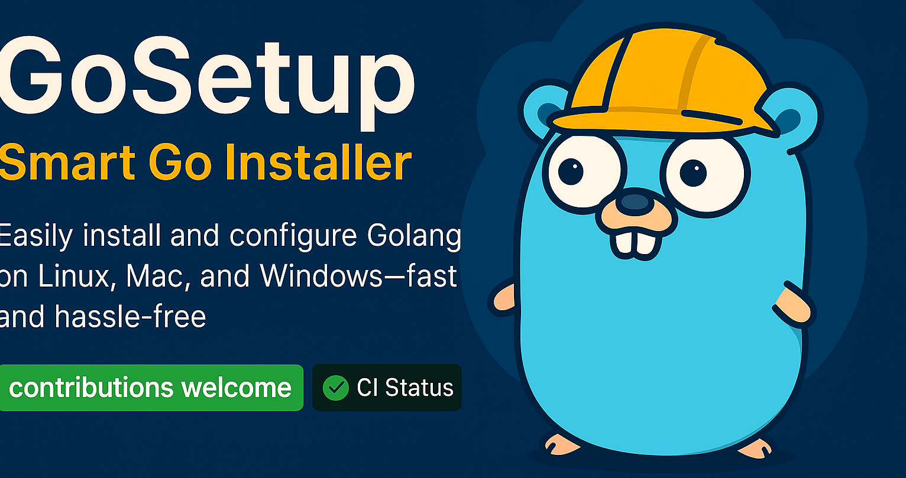

# 

## **GoSetup 🐹 ⚡ - Smart Go Installer**

🚀 **Easily install and configure Golang on Linux, Mac, and Windows—fast and hassle-free!**

[](https://github.com/rafa-mori/gosetup)  
[](https://github.com/rafa-mori/gosetup/blob/main/LICENSE)
[](https://github.com/rafa-mori/gosetup/releases)

---

## 🚀 **Quick Installation**

### 🏎️ **Instant Method (wget/curl)**

```bash
wget https://raw.githubusercontent.com/rafa-mori/gosetup/refs/heads/main/go.sh && bash gosetup.sh
```

```bash
bash <(curl -sL https://git.io/gosetup)
```

### 🛠️ **Cloning the Repository and Running Manually**

```bash
git clone https://github.com/rafa-mori/gosetup.git
cd gosetup
bash go.sh
```

> 💡 **Tip:** By default, Go will be installed in `$HOME/.go`, and `$HOME/go` will be set as the workspace.  
> You can customize these locations by setting `GOROOT` and `GOPATH` before installation:

```bash
export GOROOT=/opt/go
export GOPATH=$HOME/projects/go
```

---

## 🎯 **Features**

✅ **Automatic installation & updates**  
✅ **Specify a Go version to install**  
✅ **Compatible with Windows, Linux, and macOS**  
✅ **Smart environment configuration**  
✅ **Supports multiple architectures (ARM, AMD64, i386)**  
✅ **Seamless integration with GitHub Actions workflows**  

---

## 🛠️ **Essential Commands**

### 🔹 **Install or update Go**

```bash
bash go.sh install
```

```powershell
.\go.ps1 -Command install
```

### 🔹 **Specify a version**

```bash
bash go.sh install --version 1.19.4
```

```powershell
.\go.ps1 -Command install -Version 1.19.2
```

### 🔹 **Check if a version is installed**

```bash
bash go.sh check --version 1.19.4
```

```powershell
.\go.ps1 -Command check -Version 1.19.2
```

### 🔹 **Uninstall Go**

```bash
bash go.sh remove
```

```powershell
.\go.ps1 -Command remove
```

### 🔹 **Display the help menu**

```bash
bash go.sh help
```

```powershell
.\go.ps1 -Command help
```

---

## 🐳 **Running Tests with Docker**

Ensure a clean testing environment:

```bash
make test
```

```powershell
.\go.ps1 -Command test
```

---

## 💡 **Contribute to the Project**

1. ⭐ **Star the repository** to show support!  
2. 🔄 **Fork** and clone the repository.  
3. 🛠️ **Create a new branch** and make your changes.  
4. 📌 **Submit a pull request** and wait for review.  
5. 🎉 **Join the community and stay updated!**  

---

## 🔍 **How It Works**

The script follows these steps:
1️⃣ **Detects** your operating system and architecture.  
2️⃣ **Checks** the latest available Go version.  
3️⃣ **Downloads & installs** the correct version.  
4️⃣ **Sets up directories** (`GOROOT`, `GOPATH`).  
5️⃣ **Adds Go binaries to PATH** automatically.  
6️⃣ **Cleans up unnecessary files** to keep things efficient.  

---

## 🛠️ **Using in CI/CD with GitHub Actions**

Automate Go installation based on the version specified in `go.mod`:

```yaml
- name: Install Go (Exact version from go.mod)
  run: |
    export NON_INTERACTIVE=true
    bash -c "$(curl -sSfL 'https://raw.githubusercontent.com/rafa-mori/gosetup/main/go.sh')" -s --version "$(grep '^go ' go.mod | awk '{print $2}')"
```

---

<p align="center">🚀 **Simple. Fast. Powerful.** 🔥</p>
