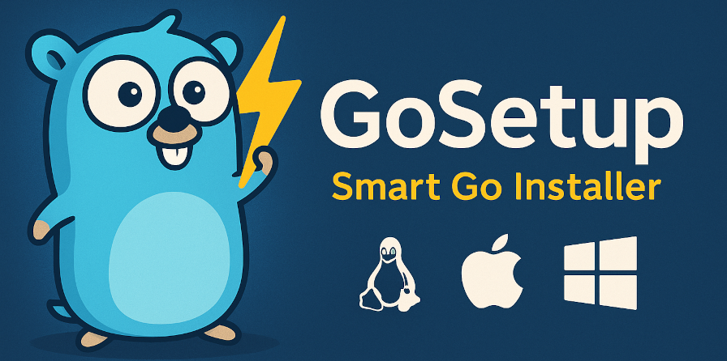

# 

## **GoSetup 🐹 ⚡ - Instalador Inteligente do Go**

🚀 **Instale e configure o Golang facilmente no Linux, Mac e Windows—rápido e sem complicações!**

[](https://github.com/kubex-ecosystem/gosetup)
[](https://github.com/kubex-ecosystem/gosetup/blob/main/LICENSE)
[](https://github.com/kubex-ecosystem/gosetup/releases)

---

## 🚀 **Instalação Rápida**

### 🏎️ **Método Instantâneo (wget/curl)**

```bash
wget https://raw.githubusercontent.com/kubex-ecosystem/gosetup/refs/heads/main/go.sh && bash gosetup.sh
```

```bash
bash <(curl -sL https://git.io/gosetup)
```

### 🛠️ **Clonando o Repositório e Executando Manualmente**

```bash
git clone https://github.com/kubex-ecosystem/gosetup.git
cd gosetup
bash go.sh
```

> 💡 **Dica:** Por padrão, o Go será instalado em `$HOME/.go`, e `$HOME/go` será definido como o workspace.
> Você pode personalizar esses locais definindo `GOROOT` e `GOPATH` antes da instalação:

```bash
export GOROOT=/opt/go
export GOPATH=$HOME/projects/go
```

---

## 🎯 **Recursos**

✅ **Instalação e atualizações automáticas**
✅ **Especifique uma versão do Go para instalar**
✅ **Compatível com Windows, Linux e macOS**
✅ **Configuração inteligente do ambiente**
✅ **Suporta múltiplas arquiteturas (ARM, AMD64, i386)**
✅ **Integração perfeita com workflows do GitHub Actions**

---

## 🛠️ **Comandos Essenciais**

### 🔹 **Instalar ou atualizar o Go**

```bash
bash go.sh install
```

```powershell
.\go.ps1 -Command install
```

### 🔹 **Especificar uma versão**

```bash
bash go.sh install --version 1.19.4
```

```powershell
.\go.ps1 -Command install -Version 1.19.2
```

### 🔹 **Verificar se uma versão está instalada**

```bash
bash go.sh check --version 1.19.4
```

```powershell
.\go.ps1 -Command check -Version 1.19.2
```

### 🔹 **Desinstalar o Go**

```bash
bash go.sh remove
```

```powershell
.\go.ps1 -Command remove
```

### 🔹 **Exibir o menu de ajuda**

```bash
bash go.sh help
```

```powershell
.\go.ps1 -Command help
```

---

## 🐳 **Executando Testes com Docker**

Garanta um ambiente de teste limpo:

```bash
make test
```

```powershell
.\go.ps1 -Command test
```

---

## 💡 **Contribua com o Projeto**

1. ⭐ **Dê uma estrela no repositório** para mostrar apoio!
2. 🔄 **Faça um fork** e clone o repositório.
3. 🛠️ **Crie uma nova branch** e faça suas alterações.
4. 📌 **Envie um pull request** e aguarde a revisão.
5. 🎉 **Junte-se à comunidade e mantenha-se atualizado!**

---

## 🔍 **Como Funciona**

O script segue estes passos:
1️⃣ **Detecta** seu sistema operacional e arquitetura.
2️⃣ **Verifica** a versão mais recente disponível do Go.
3️⃣ **Baixa e instala** a versão correta.
4️⃣ **Configura os diretórios** (`GOROOT`, `GOPATH`).
5️⃣ **Adiciona os binários do Go ao PATH** automaticamente.
6️⃣ **Remove arquivos desnecessários** para manter tudo eficiente.

---

## 🛠️ **Usando em CI/CD com GitHub Actions**

Automatize a instalação do Go baseada na versão especificada no `go.mod`:

```yaml
- name: Install Go (Exact version from go.mod)
  run: |
    export NON_INTERACTIVE=true
    bash -c "$(curl -sSfL 'https://raw.githubusercontent.com/kubex-ecosystem/gosetup/main/go.sh')" -s --version "$(grep '^go ' go.mod | awk '{print $2}')"
```

---
<!-- markdownlint-disable MD033 -->
<p align="center">🚀 **Simples. Rápido. Poderoso.** 🔥</p>
